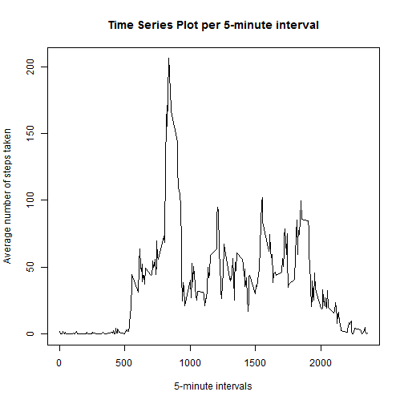

# Reproductible Research

## Peer Assessment 1

### Loading and preprocessing the data

1. Load the data


```r
# Use of data.table package
library(data.table)
dt <- as.data.table(read.csv("activity.csv", stringsAsFactors = FALSE,
                             colClasses = c("double", "Date", "integer")))
```

```
## Warning: cannot open file 'activity.csv': No such file or directory
```

```
## Error: cannot open the connection
```

2. Process/transform the data into a format suitable for further analysis


```r
# Sort dt by date and interval
setkey(dt, date, interval)
# Create dt.day with total number of steps taken per day
dt.day <- dt[,sum(steps),by=date]
setnames(dt.day, c("date","V1"), c("day","steps"))
# Create dt.mean.interval with mean steps taken per interval (ignored missing values)
dt.mean.interval <- dt[,mean(steps, na.rm=TRUE),by=interval]
setnames(dt.mean.interval, "V1", "mean.steps")
```

### What is mean total number of steps taken per day?

1. Make a histogram of the total number of steps taken each day


```r
with(dt.day, hist(steps, main = "Histogram of the total number of steps taken each day",
                  xlab = "Total number of steps taken each day"
                  )
     )
```

 

2. Calculate and report the **mean** and **median** total number of steps taken per day

*Mean total number of steps taken per day :*


```r
mean <- mean(dt.day[,sum(steps),by=day]$V1, na.rm=TRUE)
mean
```

```
## [1] 10766
```

*Median total number of steps taken per day :*


```r
median <- median(dt.day[,sum(steps),by=day]$V1, na.rm=TRUE)
median
```

```
## [1] 10765
```

### What is the average daily activity pattern?

1. Make a time series plot of the 5-minute interval (x-axis) and the average number of steps taken, averaged across all days (y-axis)


```r
with(dt.mean.interval, plot(interval, mean.steps, type = "l",
                            main = "Time Series Plot per 5-minute interval", 
                            xlab = "5-minute intervals", 
                            ylab = "Average number of steps taken"
                            )
     )
```

 

2. Which 5-minute interval, on average across all the days in the dataset, contains the maximum number of steps?


```r
dt.mean.interval[which.max(dt.mean.interval$mean.steps), "interval", with=FALSE]
```

```
##    interval
## 1:      835
```

### Imputing missing values

1. Calculate and report the total number of missing values in the dataset

*Number of missing values per column*


```r
nb.na <- colSums(is.na(dt))
nb.na
```

```
##    steps     date interval 
##     2304        0        0
```

2. Devise a strategy for filling in all of the missing values in the dataset.

*My strategy is to fill missing steps values by mean steps taken per interval*


```r
# Merge dt and dt.mean.interval by interval into dt.missing to retrieve mean.steps column
setkey(dt, interval)
setkey(dt.mean.interval, interval)
dt.missing <- dt[dt.mean.interval]
# Replace missing steps values by mean.steps ones
dt.missing[which(is.na(dt.missing$steps) > 0)]$steps <- 
        dt.missing$mean.steps[which(is.na(dt.missing$steps) > 0)]
```

3. Create a new dataset that is equal to the original dataset but with the missing data filled in


```r
# Creation of dt.new keeping the same ordered columns as dt, sorted by date and interval, but with missing data filled in
dt.new <- dt.missing[, names(dt), with=FALSE]
setkey(dt.new, date, interval)
```

4. Make a histogram of the total number of steps taken each day


```r
# Create dt.new.day with total number of steps taken per day
dt.new.day <- dt.new[,sum(steps),by=date]
setnames(dt.new.day, c("date","V1"), c("day","steps"))
# Histogram from dt.new.day of the total number of steps taken each day
hist(dt.new.day$steps, main = "Histogram of the total number of steps taken each day", 
     xlab = "total number of steps taken each day")
```

 

Calculate and report the **mean** and **median** total number of steps taken per day.

*New mean total number of steps taken per day :*

```r
newmean <- mean(dt.new.day[,sum(steps),by=day]$V1, na.rm=TRUE)
newmean
```

```
## [1] 10766
```

*New  median total number of steps taken per day :*


```r
newmedian <- median(dt.new.day[,sum(steps),by=day]$V1, na.rm=TRUE)
newmedian
```

```
## [1] 10766
```

Do these values differ from the estimates from the first part of the assignment?


```r
if(abs(mean - newmean) > 0) {"Mean and new mean differ"} else {"Mean and new mean are the same"}
```

```
## [1] "Mean and new mean are the same"
```

```r
if(abs(median - newmedian) > 0) {"Median and new median differ"} else {"Median and new median are the same"}
```

```
## [1] "Median and new median differ"
```

What is the impact of imputing missing data on the estimates of the total daily number of steps?

*Histograms look like the same shapes but frequencies of the total daily number of steps are higher in the new one because NAs have been replaced by values.*


### Are there differences in activity patterns between weekdays and weekends?
1. Create a new factor variable in the dataset with two levels - "weekday" and "weekend" indicating whether a given date is a weekday or weekend day.


```r
# weekdays function returns french names as I have chosen to keep my local params and not to set LC_TIME from Sys.setlocale function to "English"
dt.new[, weekdays := factor(weekdays(date))]
```

```
##          steps       date interval weekdays
##     1: 1.71698 2012-10-01        0    lundi
##     2: 0.33962 2012-10-01        5    lundi
##     3: 0.13208 2012-10-01       10    lundi
##     4: 0.15094 2012-10-01       15    lundi
##     5: 0.07547 2012-10-01       20    lundi
##    ---                                     
## 17564: 4.69811 2012-11-30     2335 vendredi
## 17565: 3.30189 2012-11-30     2340 vendredi
## 17566: 0.64151 2012-11-30     2345 vendredi
## 17567: 0.22642 2012-11-30     2350 vendredi
## 17568: 1.07547 2012-11-30     2355 vendredi
```

```r
levels(dt.new$weekdays) <- 
        list(weekend = c("samedi", "dimanche"), 
             weekday = c("lundi", "mardi", "mercredi", "jeudi","vendredi"))
```

2. Make a panel plot containing a time series plot of the 5-minute interval (x-axis) and the average number of steps taken, averaged across all weekday days or weekend days (y-axis).


```r
# Create dt.new.mean.interval with mean steps taken per weekday and interval (no left missing value)
dt.new.mean.interval <- dt.new[,mean(steps),by=list(weekdays, interval)]
setnames(dt.new.mean.interval, "V1", "mean.steps")
# xyplot looking something like the example but with true data
library(lattice)
xyplot(dt.new.mean.interval$mean.steps ~ 
               dt.new.mean.interval$interval | dt.new.mean.interval$weekdays, 
       layout = c(1, 2), index.cond=list(c(2,1)), type = "l", 
       xlab = "Interval", ylab = "Number of steps"
       )
```

 
